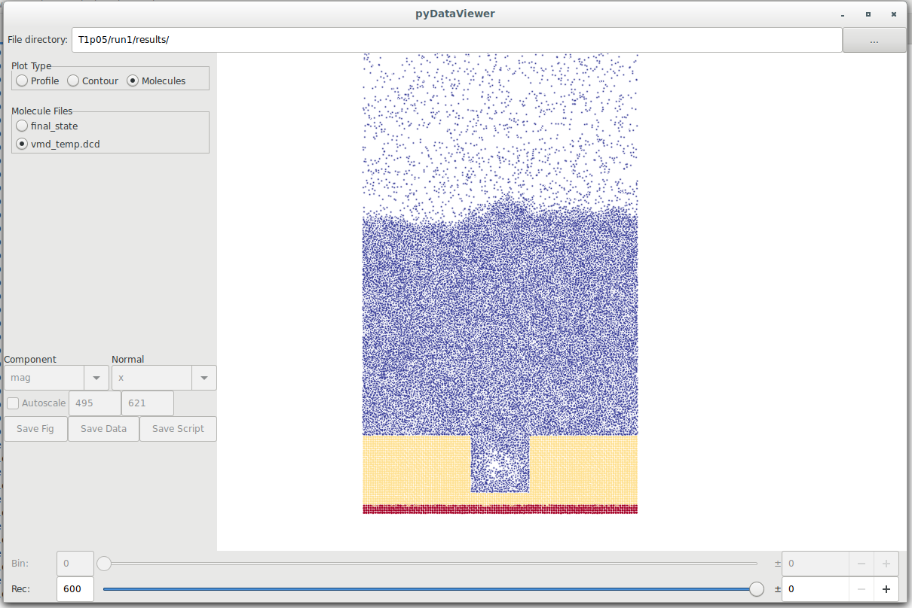
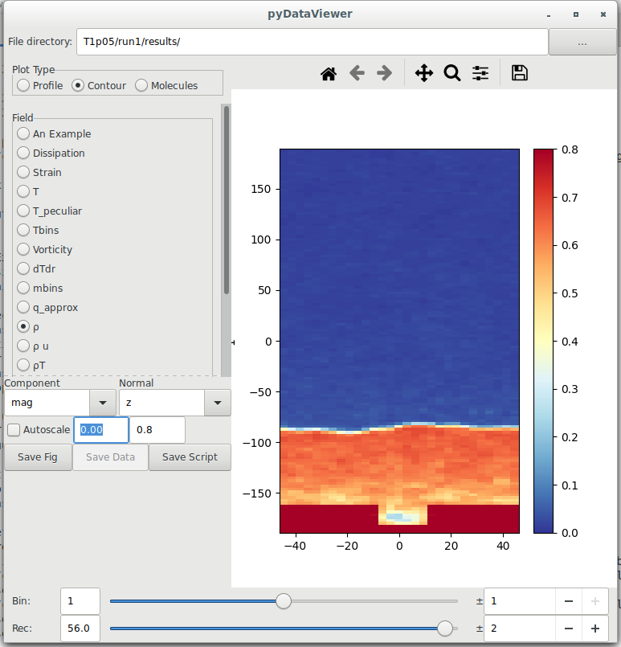

## Introduction

These are the run files to create a boiling simulation with a notch, similar to the paper by Alessio et al (2021)
but run using Flowmol instead of LAMMPS. A few minor differences are in the form of wall potential (simple Lennard Jones
here with $\epsilon=1.0$ and $\sigma =1.0$ in both fluid and solid with wetting of 1.0 between wall and fluid).
The original work uses $\epsilon=3.08$ and $\sigma =0.85$ in the wall and $\epsilon=1.0$ and $\sigma =1.0$ in the 
fluid (with varying cross interactions). These make no obvious difference to the process of nucleation.

##How to run

The latest version of the Flowmol code will likely work, but the paper outputs were obtained from the release version associated with:
https://github.com/edwardsmith999/flowmol/commit/77af04128f345d6fafdc19d53f965581793398a2
To run the code, download a copy (on linux)

`git clone https://github.com/edwardsmith999/flowmol`

navigate to the source directory

`cd flowmol/src`

You need to have gcc complilers with fortran support (gfortran) or intel compliers (ifort) and MPI (tested with mpich)

`make PLATFORM=gfortran p`

or

`make PLATFORM=intel p`

If this works, you should get an executable "parallel_md.exe"
Move this to a runs/Boiling_Square_Notch directory and to run the case call,

`mpiexec -n 6 ./parallel_md.exe -i ./MD_posts.in -r ./initial_state`

## Run Details
This reads in initial_state, generated by about 100,000 steps thermostatting everything (solid, liqud & gas) to about T=1.0
and then about 100,000 running with the wall at a temperature of 1.05 (resetting tags so just the bottom layers of the domain
are thermostatted). The initial_state is then on the point of nucleation, with the start of a bubble in the square notch.

Figure 1 - Using pyDataView to look at the molecules, with thermostatted walls molecules shown in red, wall in yellow and fluid in blue with a low density region in the notch showing the onset of boiling. 

This will take a about 300,000 timesteps to see nucleation, growth and eventual self-coelesence. 

##Postprocessing

To generate plots you can then run pyDataView (see https://github.com/edwardsmith999/pyDataView).
An example of the types of output are as follows:

Any questions, please contact the author on edward.smith@brunel.ac.uk or edwardsmith999@hotmail.com
Edward Smith (edwardsmith.co.uk, ORCID 0000-0002-7434-5912)
May 2022

